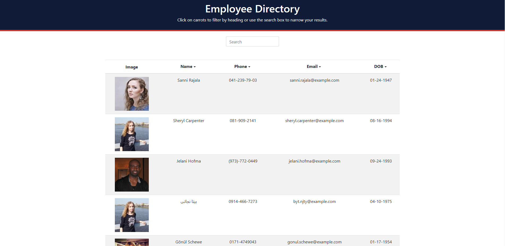
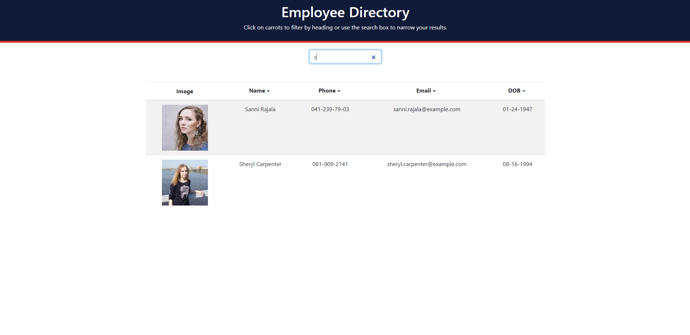
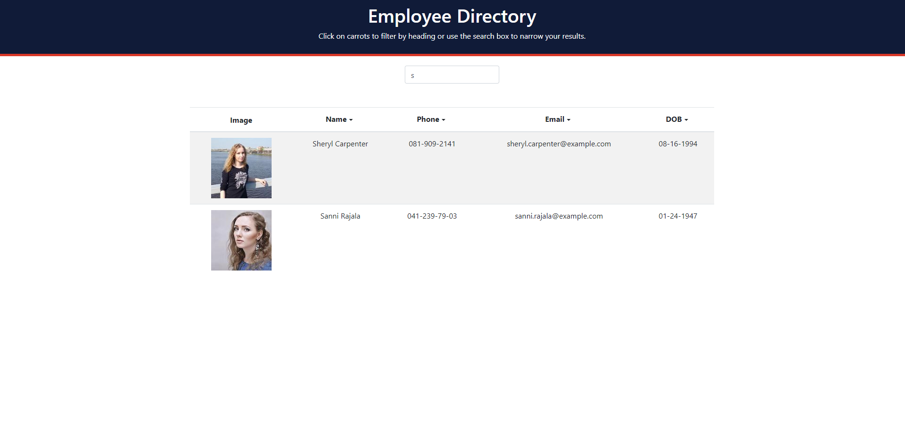

# Employee-Directory


## Description
For unit 19's homework assignment I had to create an employee directory using React! This was a difficult assignment and I found it very challenging. I am happy with the end result considering we have been using React for 1 week. 

When this application is launched, the home page automatically performs an API call and renders a list of 20 users within a Bootstrap table. Users are then able to filter by first name. Users are then able to sort alphabetically by both ascending and descending order for Name, Phone, Email and DOB.

## Table Of Contents
- [Technologies](#Technologies-Used)
- [Installation](#Installation)
- [Usage](#Usage)
- [Screenshots](#Screenshots)
- [View Live Website](#View-Live-Website)
- [Questions](#Questions)
- [License](#License)

## Technologies Used
For this application I used the following technologies: React, JavaScript HTML/CSS, Bootstrap, Heroku and GitHub pages.

## Installation
This application is easy to install, just clone the repository and run the following command in your terminal. 

```
npm install
```

This will create the node modules folder you will need in order for this application to function correctly.

## Usage
In order to get this application to run you must open up the terminal and enter the following:

```
npm start
```
The application will then console log the URL in the terminal and React automatically opens the app in your default browser.

## Screenshots
Rendered homepage

Filtered users

Filtered users that have been sorted Alphabetically


## View Live Website  
Please click **[Here](https://rocky-temple-86306.herokuapp.com/)** to view the live webpage hosted on Heroku

Please click **[Here](https://hustinkava.github.io/Employee-Directory/)** to view the live webpage hosted on GitHub pages


## Questions
To view my other repositories or to connect with me on GitHub please click **[Here](https://github.com/HustinKava/)**
If you have any questions please feel free to reach out to me at the following email: *hkavafsd@gmail.com*

## License


